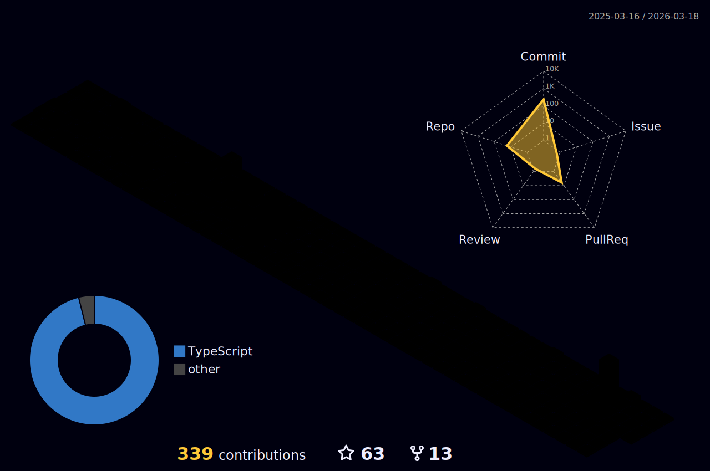

  

<h2 align="left" id="macropower-tech">Favorite Tech</h2>

<table align="center">
  <tr>
    <td align="center" width="96">
        
       React
    </td>
    <td align="center" width="96">
        
       TypeScript
    </td>
    <td align="center" width="96">
        
       JavaScript
    </td>
    <td align="center" width="96">
        
       Python
    </td>
    <td align="center" width="96">
        
       Next.js
    </td>
    <td align="center" width="96">
        
       Node.js
    </td>
    <td align="center" width="96">
        
       AWS
    </td>
    <td align="center" width="96">
        
       MySQL
    </td>
    <td align="center" width="96">
        
       GitHub
    </td>
  </tr>
  <tr>
    <td align="center" width="96">
        
       Tailwind
    </td>
    <td align="center" width="96">
        
       Prisma
    </td>
    <td align="center" width="96"> 
        
       Git
    </td>
    <td align="center" width="96">
        
       PostgreSQL
    </td>
    <td align="center" width="96">
        
       MongoDB
    </td>
    <td align="center" width="96">
        
       Docker
    </td>
    <td align="center" width="96">
        
       Supabase
    </td>
    <td align="center" width="96">
        
       Vercel
    </td>
    <td align="center" width="96">
        
       VS Code
    </td>
  </tr>
  <tr>
    <td align="center" width="96">
        
       HTML5
    </td>
    <td align="center" width="96">
        
       CSS
    </td>
    <td align="center" width="96">
        
       Sass
    </td>
    <td align="center" width="96">
        
       GraphQL
    </td>
    <td align="center" width="96">
        
       Figma
    </td>
    <td align="center" width="96">
        
       Postman
    </td>
    <td align="center" width="96">
        
       Express
    </td>
    <td align="center" width="96">
        
       Redis
    </td>
    <td align="center" width="96">
        
       Firebase
    </td>
  </tr>
</table>

> GitHub Activity Graph

 

  
  
  

> GitHub 3D Contributors

 
